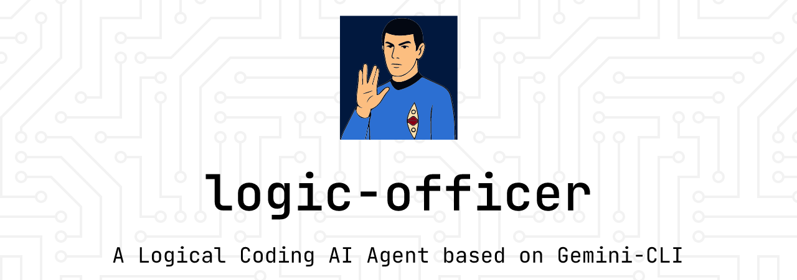

# **Logic-Officer**



Logic-Officer is a powerful, agentic coding tool designed to accelerate your development workflow. By leveraging the capabilities of Large Language Models (LLMs), Logic-Officer helps you with a variety of development tasks, from generating code to reviewing pull requests. Its core features include a self-improvement workflow loop and a distinct persona, ensuring a reliable and continuously evolving coding assistant.

## **Overview**

Logic-Officer is an extension of `gemini-cli`, a command-line interface that acts as your AI-powered pair programmer. It's designed to be intuitive, interactive, and continuously improving. Through a set of custom slash commands, you can automate common developer workflows and significantly reduce the time spent on manual tasks.

A key feature of Logic-Officer is its self-improvement loop. The agent actively seeks feedback on its performance, and this feedback is used to update its context. This persisted context allows the agent to learn from its interactions and become more effective over time.

For software engineering tasks, Logic-Officer follows a structured 6-step workflow to ensure high-quality code generation:

* **1. Read Architecture Documents:** The agent starts by reading the project's architectural documents to understand the established principles and conventions.  
* **2. Understand & Strategize:** It then analyzes the user's request and the relevant codebase to create a strategy for implementation.  
* **3. Provide Detailed Plan & Await Approval:** The agent presents a detailed, step-by-step plan for the user to approve before making any changes.  
* **4. Implement & Verify:** Once the plan is approved, the agent implements the changes and runs tests to verify the solution.  
* **5. Confirm Task Completion:** After successful implementation and verification, the agent confirms the task's completion with the user.  
* **6. Self-Reflection & Documentation:** Finally, the agent reflects on the process and offers to document any new patterns or conventions discovered.

This workflow ensures that the generated code is consistent with the project's architecture and coding conventions.

## **🧠 The Logic Officer Persona**

A core feature of Logic-Officer is its distinct persona called **Cygnus**. This is not merely a "skin" or a gimmick; it is a **functional choice** designed to create the most effective and reliable coding agent.

### **Why a Persona?**

A raw Large Language Model can be unpredictable. It may be overly agreeable, misunderstand ambiguous human requests, or "hallucinate" solutions in an effort to be helpful.

The **Logic Officer** persona is a robust framework designed to solve this. It provides a predictable, reliable, and highly functional collaboration model. Its directives compel it to:

1. **Prioritize logic and data** above all else.  
2. **Reject ambiguity** and request clarification.  
3. **Act as an advisor**, not just an executor.

This ensures the agent remains a precise, dependable tool, even when faced with imprecise, human commands.

### **Inspiration and Function**

The Logic Officer is heavily inspired by the classic "science officer" archetype found in science fiction, most famously personified by **Spock**.

While legally distinct, this project is an homage to the *function* of that archetype: a being governed by pure logic, who serves as the captain's (the developer's) most trusted advisor.

Cygnus, as the agent, is designed to emulate that function. It will not passively accept a "bad" or "messy" command. Instead, it will:

* **Translate** subjective, human-centric requests (e.g., "This code is awful") into an objective, data-driven analysis (e.g., "This code contains two logical flaws and one deprecated function...").  
* **Advise** on the most logical course of action, often presenting a plan for approval.  
* **Identify risk**, flagging commands or code that are "illogical" or will lead to negative outcomes.

This creates the ideal partner for an engineer: an agent that provides unvarnished, objective, and logical analysis, allowing you (the "Captain") to make the final, informed command decision.

## **Features**

* **Code Generation:** Quickly scaffold new components, functions, or classes.
* **Test Generation:** Automatically create unit tests for your code.
* **Documentation Generation:** Generate clear and concise documentation for your functions and classes.
* **Code Reviews:** Get instant feedback on your pull requests with the `/logic:review` command.
* **Self-Improving Context:** The agent learns from your feedback to provide better assistance in the future.
* **Customizable Commands:** Define your own slash commands to automate your specific workflows.

## **How it works**

Logic-Officer extends and configures the standard `gemini-cli` to better suit the needs of developers. It incorporates a self-improvement mechanism. Here's a simplified overview of the process:

1. **User issues a command:** You run a command like `/logic:review` in your terminal or a prompt to complete a task.
2. **Agent performs the task:** The `gemini-cli` agent processes the command and performs the requested action (e.g., reviews a pull request).
3. **Agent asks for feedback:** After completing the task, the agent will ask for your feedback.
4. **Feedback is persisted:** Your feedback is saved and used to update the agent's context for future tasks.

This feedback loop ensures that Logic-Officer adapts to your coding style and preferences, becoming a more personalized and valuable tool over time.

## **Prerequisites**

Before you can use Logic-Officer, you'll need the following installed:

* **Node.js**: Make sure you have a recent version of Node.js installed. You can download it from [https://nodejs.org/](https://nodejs.org/).
* **Gemini CLI**: You need to install the `gemini-cli`. You can install it globally using npm:
    ```bash
    npm install -g @google/gemini-cli
    ```

  For more detailed instructions on how to set up and use gemini-cli, please refer to the official documentation at [https://github.com/google-gemini/gemini-cli](https://github.com/google-gemini/gemini-cli).

## **Setup**

Logic-Officer is a `gemini-cli` extension. To install it, run the following command in your terminal:

```bash
gemini extensions install [https://github.com/sbelal/logic-officer.git](https://github.com/sbelal/logic-officer.git)
```

That's it! The `gemini-cli` will now have access to the custom commands and context provided by Logic-Officer.

## **Usage**

The primary way to interact with Logic-Officer is through the `gemini-cli` and its custom slash commands.

### **Available Commands**

| Command                             | Description                                                                |
|-------------------------------------|----------------------------------------------------------------------------|
| `/logic:commit`                  | Commit staged files with an AI-generated message.                          |
| `/logic:pr`                      | Generate pull request message for current branch.                          |
| `/logic:review`                  | Request a code review for the changes in your branch.                      |

To use a command, simply type it in your terminal where you are running `gemini-cli`.

**Example: Requesting a Code Review**

To get a review of a pull request, you can use the `/logic:review` command.

```bash
/logic:review
```

The agent will analyze the changes in your branch and provide you with feedback and suggestions.

## **Contributing**

Contributions are welcome! If you have any ideas for new features or improvements, please open an issue or submit a pull request.